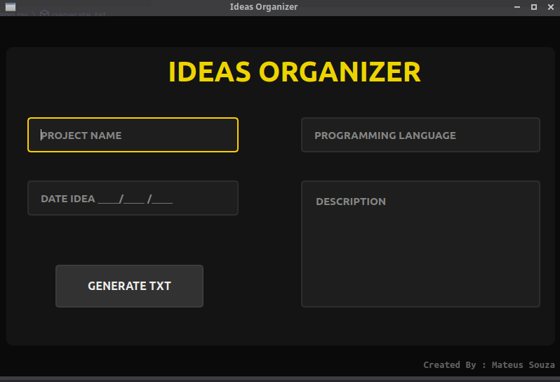
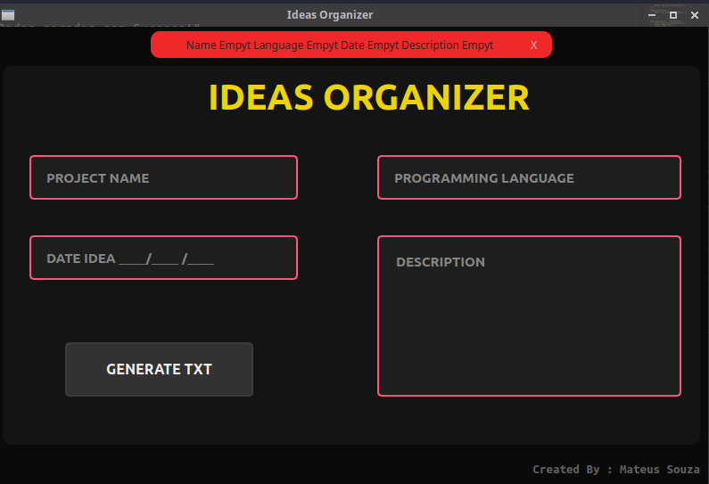
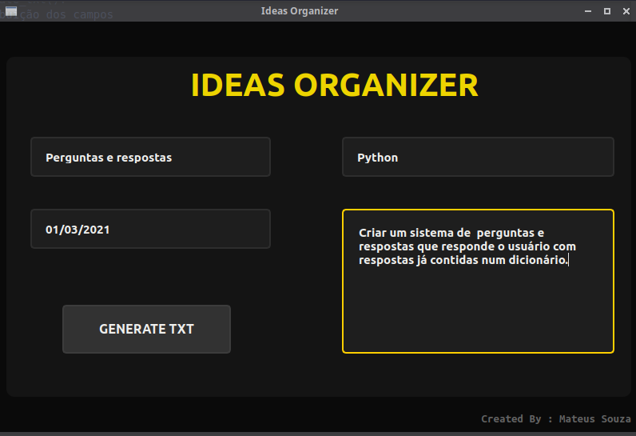
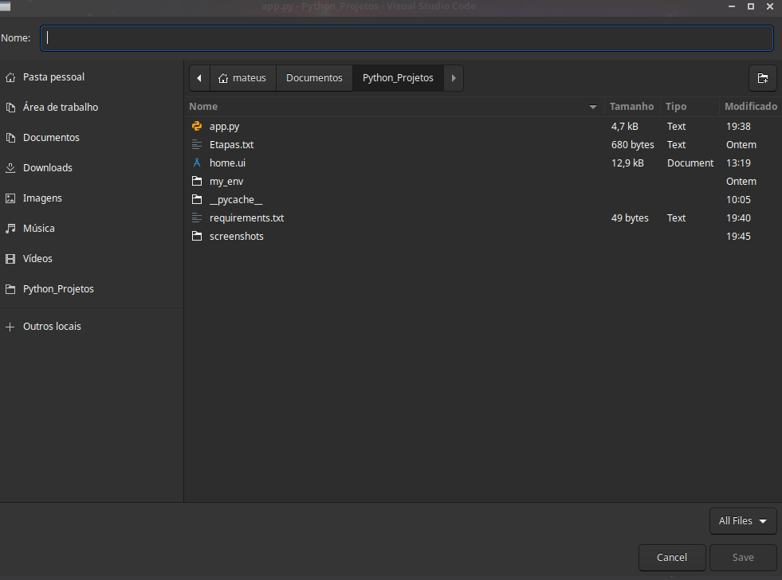
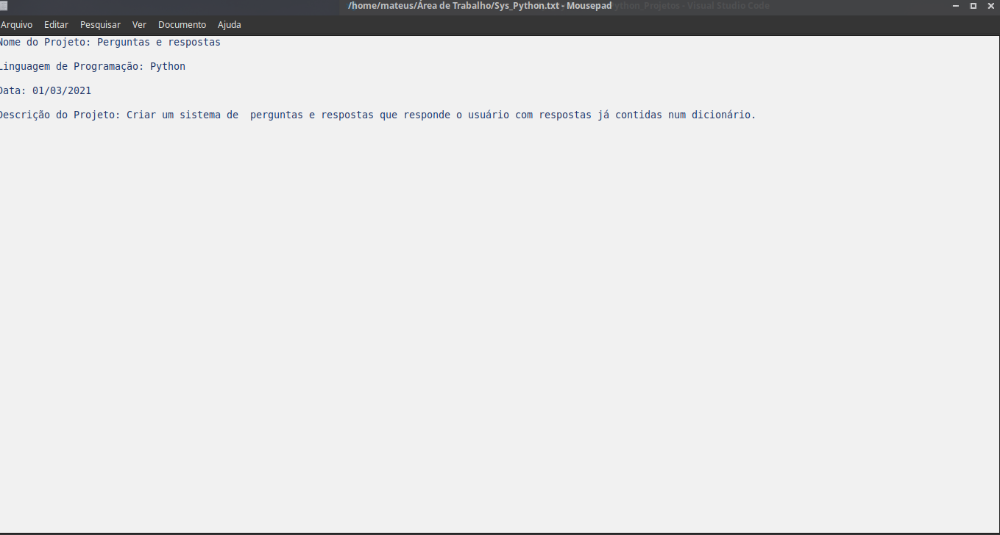

# ORGANIZER IDEAS

Projeto desenvolvido para a uso pessoal e tambem uma forma de aplicar os conhecimentos já aprendidos.

## Objetivo

Quem nunca esqueceu em um determinado momento, uma idea que posteriormente poderia ter sido transformado num projeto.Pensando nisso este programa tem como objetivo ser uma ferramenta prática, onde o usuario pode anotar ideias de projetos na area da programação, e através de um click num botão escolher uma pasta onde o mesmo poderá salvar as principais informações desta idea num arquivo .txt.

## Tecnologias

`Obs: É necessário ter um ambiente de desenvolvimento Python instalado em sua máquina.`

- [Python 3.8](https://www.python.org/downloads/)

- [VsCode](https://code.visualstudio.com/download)

- [Biblioteca PyQt5](https://pypi.org/project/PyQt5/)

## Screenshots

## Licença

Este projeto está sob a licença MIT.

## Autor

Mateus Souza de Jesus, formado em Analise e Desenvolvimento de Sistemas, pelo Centro Universitário Leonardo da Vinci. Estudo a linguagem Python, e também ciência de dados.
